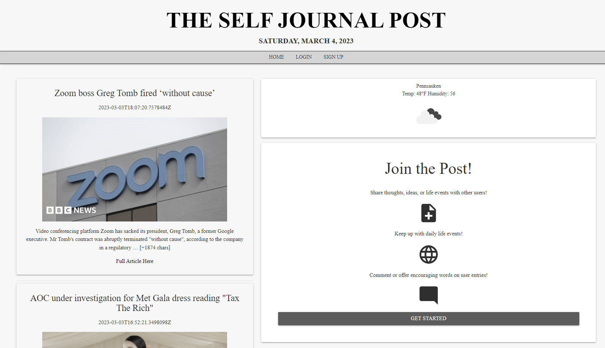

# The Self Journal Post v2
This repo is a copy of my group project, created by myself, Valentina Guevara, Jenna Clementi, and David Yu. Significant changes were made to the application to improve its functionality, including the implementation of Cloudinary for image uploads and a complete visual overhaul for cohesiveness. The original repo is [here.](https://github.com/jennahopeclem/self-journal)

## Description

The Self Journal Post is a web application that allows users to create and share their journal entries with pictures. It uses MySQL and Sequelize for the database, Handlebars as the view engine, Node.js, and Express.js to build REST API. This project is a repo that was copied from a group project that Valentina and I were a part of. We decided to create a copy of the original (linked above) and made changes to completely revamp the page visually to give users a better experience and also implemented Cloudinary to enable users to be able to upload pictures with their posts.

Link: [Self Journal Post](https://selfjournalpost.herokuapp.com/) 

## Table of Contents

- [Installation](#installation)
- [Usage](#usage)
- [Contributing](#contributing)
- [Credits](#credits)
- [License](#license)

## Installation
To get started with The Self Journal Post, you need to have Node.js and MySQL installed on your machine. You also need to have a Cloudinary account to enable picture uploads.

1. Clone the repository to your local machine using git clone.

2. Install dependencies by running npm install.

3. Create a .env file at the root of the project and add your MySQL and Cloudinary credentials in the following format:
    + DB_NAME=your_database_name
    + DB_USER=your_database_username
    + DB_PASSWORD=your_database_password
    + CLOUDINARY_CLOUD_NAME=your_cloudinary_cloud_name
    + CLOUDINARY_API_KEY=your_cloudinary_api_key
    + CLOUDINARY_API_SECRET=your_cloudinary_api_secret

4. Start the server by running npm start.

## Usage
Explore the Self Journal Post with this login:
Email: user@test.com
Password: password

Once the server is running, you can access the web application in your browser by navigating to http://localhost:3001. From there, you can create an account, log in, and start creating and sharing your journal entries with pictures.

## Contributing
Contributions to The Self Journal Post are welcome! To contribute, please follow these steps:

1. Fork the repository.
2. Create a new branch for your feature or bug fix.
3. Make your changes and commit them with descriptive commit messages.
4. Push your changes to your fork.
5. Submit a pull request.

## Credits

- Link: [Michelle Tran](https://github.com/michelletrn 'Github page for Michelle Tran')
- Link: [Valentina Guevara](https://github.com/Val-gee 'Github page for Valentina Guevara')

## License

The Self Journal Post is licensed under the MIT License.
